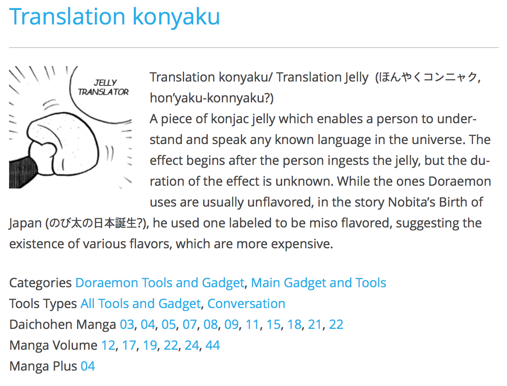
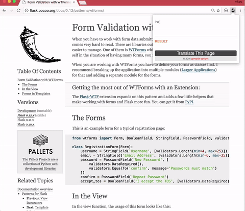

# jelly translator

# what is jelly translator?



image_captured from http://doraemon.mangawiki.org/translation-konjac/

```js

It is an extension program that breaks down language barriers like jelly in Doraemon.

```


# download on chrome store

https://chrome.google.com/webstore/detail/jelly-translator/lecfocdhckbmhibflggjmaohgnpdadck

#Manual

>read https://gomjellie.github.io/jelly-translator